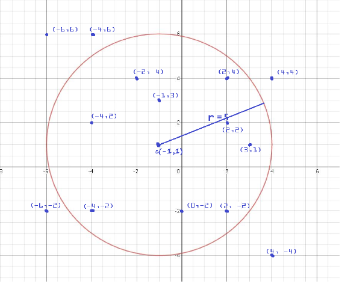

# Corona-Search-
Wrote a C program that utilizes merge sort and binary search algorithm to filter out and search points that are within the radius that had cases of coronavirus for course COP 3502C at the University of Central Florida

# Usage
For your convenience, here is how you could do it in CMD environment.

1. First compile: gcc coronasearch.c
2. After compilation, to run the program, you would type the following command: a.exe

# Output 
Data in input file in.txt (the red points are outside of the circle):
~~~
-1 1 5 14
3 1
-6 -2
-4 2
4 -4
2 4
-1 3
2 2
0 -2
-4 -2
-6 6
4 4
-2 4
2 -2
-4 6
~~~

Sample output file out.txt:
~~~
-4 -2 
-4 2 
-2 4 
-1 3 
0 -2 
2 -2 
2 2 
2 4 
3 1 
~~~

Console input and outputs
~~~
filtered and sorted data written to out.txt
Search input (x y): 2 -1
Output: Not found
Search input (x y): 3 1
Output: Found at record 9
Search input (x y): 2 -2
Output: Found at record 6
Search input (x y): -4 2
Output: Found at record 2
Search input (x y): -4 -2
Output: Found at record 1
Search input (x y): -999 10
Output: exit
~~~
