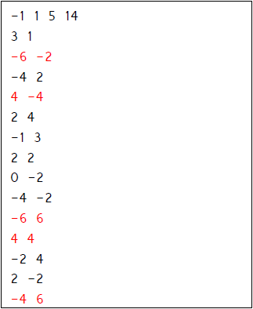
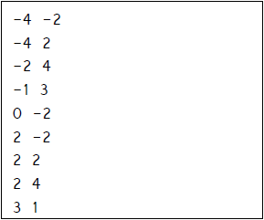

# Corona-Search-
*Corona Search* is a C program that utilizes merge sort and binary search algorithm to filter out and search points that are within the radius that have cases of coronavirus.  
  

# Usage
For your convenience, here is how you could do it in CMD environment.

1. First compile: gcc main.c
2. After compilation, to run the program, you would type the following command: a.exe

# Coordinate points 
Data in input file in.txt (the red points are outside of the circle):  
  
The numbers are x coordinate of the center of the circle, y coordinate of the center of the circle, r the radius of the circle, and N that says how many points are there in the file.  

# Filtered and Sorted Points
*Note:*    
-4 -2 = Record 1  
...  
3 1 = Record 9  

**Output file out.txt:**  

# Compile Example
~~~
filtered and sorted data written to out.txt
Search input (x y): 2 -1
Output: Not found
Search input (x y): 3 1
Output: Found at record 9
Search input (x y): 2 -2
Output: Found at record 6
Search input (x y): -4 2
Output: Found at record 2
Search input (x y): -4 -2
Output: Found at record 1
Search input (x y): -999 10
Output: exit
~~~
